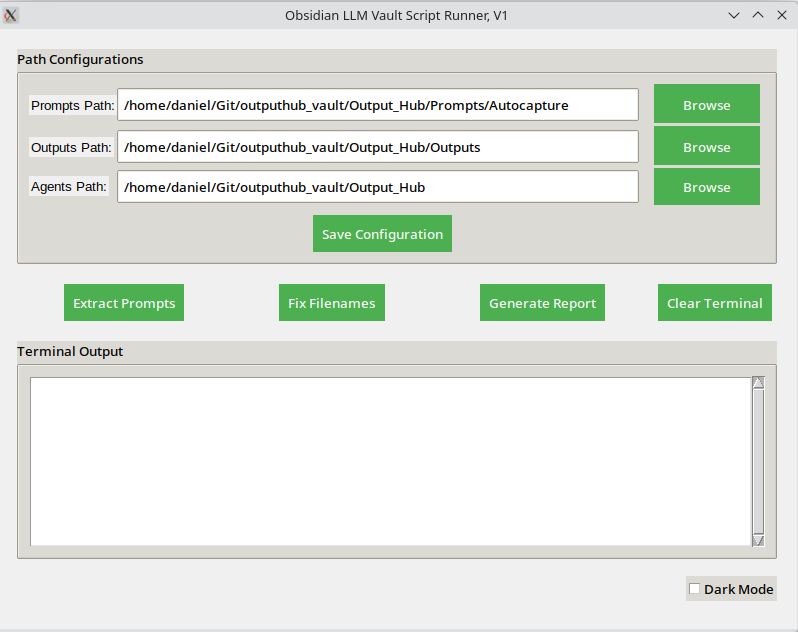

# Obsidian As An LLM Output Capture Tool

I created this repository in order to share a few resources that I've developed (or am developing) for the purpose of using Obsidian as a solution for capturing the outputs of interactions with large language models (LLMs) especially GPTs. 

My long term plan remains building a database-backed solution for this very purpose (see: "Output Hub" repositories!). But as a stopgap and while my project is under development, I'm enjoying using Obsidian to collect them (and who knows ... perhaps this will be my long term direction!).

---

## Folder Structure

See the `tree structure`  document within `Documentation`.

```
├── Agents/
│ └── CustomGPT1.md
├── Prompts/
│ ├── General/
│ └── Specific/
├── Outputs/
│ ├── Raw/
│ └── Processed/
├── Context/
│ ├── Background/
│ └── CurrentState/
├── Metadata/
│ ├── Tags/
│ └── Categories/
└── Templates/
├── AgentTemplates/
└── PromptTemplates/
```

Key directories:

- **Agents** is for storing configuration files for custom LLM agents (like custom GPTs). Users may wish to note these configuration parameters in markdown or JSON.
- **Prompts** is for storing prompts in a prompt library. I use a subfolder called `autopopulated` in order to distinguish between prompts that I've worked on and engineered versus those which I've programatically stripped from outputs with my management script
-  **Outputs** is for saving outputs (and prompts) together in one file
-  **Context** is for saving snippets providing context for key projects (or details about your career!) with the idea that this can be attached to LLM UIs in order to quickly provide a key set of contextual factors to ground and direct a specific output. For example, I have a markdown file which stores the key details of my project to create a knowledge base for LLM outputs. If I'm working with a new LLM and using it for tech stack ideation, I can quickly drop this file into the chat to set the appropriate context. This saves me from having to repeat the same details many times.

---

## Vault Manager GUI



A simple Python GUI for running administration and optimisation activities over the vault.

Functions are:

1) Extract prompts (by copying saved prompts from `/Outputs` to `/Prompts` and automatically creating backlinks)
2) Linting nonvalid characterse from filenames
3) Facilitating the easy generation of reports to keep track of growth in activity for saved outputs, prompts, and agents

Icon: Freepik
 
---

## Author

Daniel Rosehill  
(public at danielrosehill dot com)

## Licensing

This repository is licensed under CC-BY-4.0 (Attribution 4.0 International) 
[License](https://creativecommons.org/licenses/by/4.0/)

### Summary of the License
The Creative Commons Attribution 4.0 International (CC BY 4.0) license allows others to:
- **Share**: Copy and redistribute the material in any medium or format.
- **Adapt**: Remix, transform, and build upon the material for any purpose, even commercially.

The licensor cannot revoke these freedoms as long as you follow the license terms.

#### License Terms
- **Attribution**: You must give appropriate credit, provide a link to the license, and indicate if changes were made. You may do so in any reasonable manner, but not in any way that suggests the licensor endorses you or your use.
- **No additional restrictions**: You may not apply legal terms or technological measures that legally restrict others from doing anything the license permits.

For the full legal code, please visit the [Creative Commons website](https://creativecommons.org/licenses/by/4.0/legalcode).